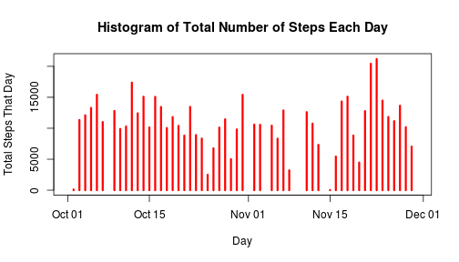

# Reproducible Research: Peer Assessment 1


## Code to read in the data set

```r
unzip("activity.zip")
dat<-read.csv("activity.csv")
```
## Histogram of the total number of steps taken each day


```r
vSums <- as.vector(tapply(dat$steps, dat$date, sum))
nlvl <- length(levels(dat$date))
par(mfrow = c(1, 1))
plot(c(1:nlvl), vSums, type = "h", lwd = 3, col = "red", xaxt = "n", xlab = "Day", 
    ylab = "Total Steps That Day")
title(main = "Histogram of Total Number of Steps Each Day")
vTicks <- c(1, 15, 31, 46, 61)
axis(1, vTicks, levels(dat$date)[vTicks])
```

 

```r
mean1 <- as.integer(mean(vSums, na.rm = TRUE))
median1 <- as.integer(median(vSums, na.rm = TRUE))
```

* The mean total number of steps per day is 10766
* The median total number of steps per day is 10765

## Time series plot of the average number of steps taken (averaged across all days) versus the 5-minute intervals


```r
facinterval<-as.factor(dat$interval)
vMeans<-as.vector(tapply(dat$steps,facinterval,mean,na.rm=TRUE))
vInterval<-as.numeric(levels(facinterval))
plot(vInterval,vMeans,type="l",main="Time series plot",xlab="interval",ylab="average number of steps at that interval")
```

 

```r
maxmean<-vInterval[which.max(vMeans)]
```
The 5-minute interval that, on average, contains the maximum number of steps is 835


## Strategy for imputing missing data

The strategy is to use mean across all days at that particular time interval to replace the NAs. we know that NAs will be throughout the entire day if they are in the data set
so we can go through each element of the data set, and if we see an NA, we replace it and all the values for that day with our vMeans vector


```r
incompletes<-sum(!complete.cases(dat))
dat2<-dat
for(i in 1:length(dat2$steps))
{
  #if its an NA
  if(is.na(dat2$steps[i]))
  {
    # replace it and the rest of the values for that day with vMeans
    dat2$steps[i:(i+length(vMeans)-1)]<-vMeans
  }

}
vSums2<-as.vector(tapply(dat2$steps,dat2$date,sum))
```

The number of NAs in the original data set is 2304


## Histogram of the total number of steps taken each day after missing values were imputed


```r
plot(c(1:nlvl), vSums2, type = "h", lwd = 3, col = "red", xaxt = "n", xlab = "Day", 
    ylab = "Total Steps That Day")
title(main = "Histogram of Total Number of Steps Each Day with  NAs replaced by the mean at each day")
axis(1, vTicks, levels(dat2$date)[vTicks])
```

 


```r
mean2<-as.integer(mean(vSums2))
median2<-as.integer(median(vSums2))
```

The mean total number of steps per day is 10766
The median total number of steps per day is 10766

By replacing the NAs, it raises the median by 1 level, so not too much. the median wasnt that far from the mean anyways. The mean stays the same. 

## Panel plot comparing the average number of steps taken per 5-minute interval across weekdays and weekends


```r
dat2$daytype<-weekdays(strptime(as.character(dat2$date),"%Y-%m-%d"))
for(i in 1:length(dat2$daytype))
{
  # if its saturday or sunday
  if(dat2$daytype[i]=="Sunday" || dat2$daytype[i]=="Saturday")
  {
    # replace it with weekend
    dat2$daytype[i]<-"weekend"
  }
  #otherwise replace it with weekday
  else { dat2$daytype[i]<-"weekday" }
}
dat2$daytype<-as.factor(dat2$daytype)
dfMeans<-aggregate(steps~interval+daytype,dat2,mean)
dfMeans$steps<-round(dfMeans$steps,0)
par(mfrow=c(2,1))
with(dfMeans, {
  plot(interval[daytype=="weekend"],steps[daytype=="weekend"],type="l",main="Weekend",xlab="Time interval",ylab="Mean steps at each time interval")
  plot(interval[daytype=="weekday"],steps[daytype=="weekday"],type="l",main="Weekday",xlab="Time interval",ylab="Mean steps at each time interval")
})
```

 
